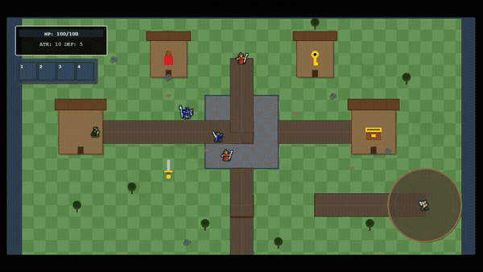
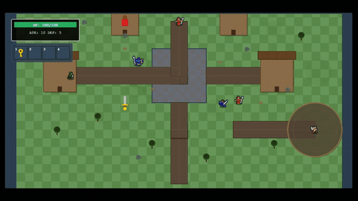
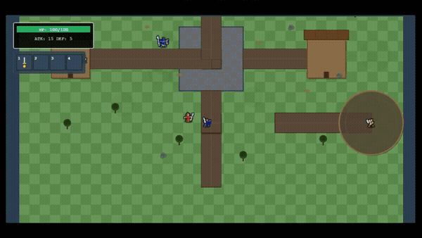

# Little Garden

A miniature RPG with an AI-powered tutorial master NPC. Meet **Hestia**, your intelligent guide who demonstrates core AI agent capabilities: **Tool Use**, **Planning**, **Memory**, and **Reasoning** as she teaches you how to play through natural conversation.

### Gameplay Demo

<p align="center">
  <strong>Introduction & Interaction</strong><br>
  
</p>

<p align="center">
  <strong>Item Collection & Chest Opening</strong><br>
  
</p>

<p align="center">
  <strong>Combat Preparation</strong><br>
  
</p>

<p align="center">
  <strong>Combat & Victory</strong><br>
  
</p>

## Overview

Little Garden features Hestia, a specialized AI agent designed to guide adventurers through learning the game. Unlike static tutorials, Hestia:

- **Adapts** to each user's learning pace and style
- **Remembers** what you've already learned
- **Plans** the optimal teaching sequence (movement → interaction → looting → combat)
- **Explains** the reasoning behind game mechanics and tactics

## Core Features

### Tool Use
Hestia can interact with the game to check player progress, monitor game state, highlight tiles, and guide users through actions. Tools include checking game state, highlighting UI elements, and tracking objectives.

### Planning
Intelligently plans tutorial sequences (movement → NPC interaction → looting → combat) based on player progress, adapting the teaching pace in real-time.

### Memory
Remembers what players have learned, tracks mastery levels, and builds a personalized teaching history across sessions.

### Reasoning
Explains why game mechanics work the way they do, shows connections between actions, and provides tactical context for better understanding.

## Tech Stack

- **Backend**: Node.js 18+, TypeScript, Express.js, direct OpenAI API integration
- **Frontend**: Phaser.js 3, Vite, ES6 modules
- **AI**: OpenAI GPT-4 with function calling
- **Architecture**: Modular design with separated game logic, UI, dialogue, and i18n translation system

## Project Status

Little Garden is currently a **prototype / MVP demo**, not a full commercial game. It is intended as a **proof of concept** for:

- Using an AI agent (Hestia) to drive an in-game tutorial
- Integrating backend tools with a Phaser-based frontend
- Demonstrating agent capabilities (planning, memory, reasoning) in a small, contained RPG

See [PROJECT_PLAN.md](./PROJECT_PLAN.md) for the development roadmap.

## AI Agent Status

The backend includes a **real agent implementation** (`TutorialAgent`) that calls OpenAI’s Chat Completions API and uses:

- Tool calls to query and update game state
- Memory to track what the player has learned
- A planning module to decide what to teach next

To run Hestia as a true AI agent you must:

1. Provide a valid `OPENAI_API_KEY` in `backend/.env`  
2. Run the backend (`npm run dev` in `backend/`)  
3. Start the frontend and talk to Hestia in-game

> **Budget note:** Running the full agent incurs OpenAI usage costs. If you do not provide an API key or do not run the backend, the game itself still runs, but Hestia’s behavior will be limited or unavailable.

### Path to a Production-Grade Agent

This repo focuses on the **gameplay and agent orchestration**. To turn it into a production-ready AI agent, you would typically add:

- **Persistent storage** for user progress (DB instead of in-memory `Memory`)
- **Auth & rate limiting** to control access and manage API costs
- **Observability & logging** for prompts, tool calls, and failures
- **Model provider configuration** (e.g., switch models, add retries, fallbacks)
- **Stronger safety and guardrails** around tool use and responses

## Getting Started

### Backend Setup

1. Navigate to the backend directory:
```bash
cd backend
```

2. Install dependencies:
```bash
npm install
```

3. Create a `.env` file:
```
PORT=3000
OPENAI_API_KEY=your_openai_api_key_here
```

4. Run the development server:
```bash
npm run dev
```

The server will start on `http://localhost:3000`

### Frontend Setup

1. Navigate to the frontend directory:
```bash
cd frontend
```

2. Install dependencies:
```bash
npm install
```

3. Run the development server:
```bash
npm run dev
```

The game will be available at `http://localhost:5173` (or the next available port if 5173 is in use - check the terminal output for the actual URL)

4. Start playing! Move with WASD or arrow keys, press E to interact with Hestia and other entities.

## Game Features

- **Free-form Movement**: Explore the village with smooth character movement
- **NPC Interactions**: Talk to NPCs to receive quests and guidance
- **Item Collection**: Collect items (potions, keys, swords) and manage inventory
- **Combat System**: Battle enemies with attack and defense mechanics
- **Quest System**: Complete quests to progress through the tutorial
- **AI Companion**: Hestia provides intelligent, adaptive guidance

## Project Structure

```
backend/
├── src/
│   ├── agent/
│   │   ├── core/
│   │   │   ├── agent.ts      # Main agent orchestration
│   │   │   ├── tools.ts      # Tool definitions and execution
│   │   │   ├── memory.ts     # Memory system
│   │   │   ├── planning.ts   # Tutorial planning logic
│   │   │   ├── prompts.ts    # System prompts
│   │   │   └── types.ts      # TypeScript types and enums
│   │   └── knowledge/
│   │       └── tutorialDb.ts # Tutorial knowledge base
│   ├── api/
│   │   └── routes.ts         # Express API routes
│   ├── config/
│   │   └── env.ts            # Environment configuration
│   └── translations/
│       └── en.json           # Tool descriptions
└── package.json

frontend/
├── game/
│   ├── assets/
│   │   └── assetLoader.js    # Asset loading
│   ├── core/
│   │   ├── gameInit.js       # Game initialization
│   │   ├── gameScene.js      # Main Phaser scene
│   │   └── entities.js       # Entity creation
│   ├── dialogue/
│   │   ├── dialogueBox.js    # Main dialogue system
│   │   ├── speechBubbles.js  # NPC speech bubbles
│   │   └── objectMessages.js # Temporary object messages
│   ├── gameLogic/
│   │   ├── combat.js         # Combat system
│   │   ├── hestia.js         # Hestia AI companion
│   │   ├── interactions.js   # Interaction handling
│   │   ├── items.js          # Item management
│   │   ├── movement.js       # Player movement
│   │   ├── quests.js         # Quest system
│   │   └── highlight.js     # Tile highlighting
│   ├── map/
│   │   ├── camera.js          # Camera controls
│   │   └── mapRenderer.js    # Map rendering
│   ├── sprites/
│   │   ├── animations.js     # Sprite animations
│   │   └── spriteFactory.js  # Sprite creation
│   ├── ui/
│   │   ├── healthBar.js       # Health and stats UI
│   │   ├── inventory.js      # Inventory UI
│   │   └── interactionPrompt.js # Interaction prompts
│   ├── utils/
│   │   └── i18n.js           # Internationalization
│   ├── gameConstants.js      # Game constants
│   └── gameState.js           # Global game state
├── locales/
│   └── en.json               # Translation strings
├── public/
│   └── assets/
│       └── fantasy-battle/     # Game assets (sprites, tiles)
├── index.html
├── main.js                    # Entry point
├── rpg.js                     # Game initialization
├── tutorial.js                # Backend integration
├── vite.config.js             # Vite configuration
└── package.json
```

## Internationalization (i18n)

The game uses a translation system for all user-facing text. Translation strings are stored in `frontend/locales/en.json` and accessed via the `t()` function from `frontend/game/utils/i18n.js`.

To add a new language:
1. Create a new JSON file (e.g., `es.json`, `fr.json`) in `frontend/locales/`
2. Copy the structure from `en.json` and translate the values
3. Update `i18n.js` to support language switching

## Credits

- **Sprites**: Fantasy Battle Pack by Matthew Walkden
  - License: See `frontend/public/assets/fantasy-battle/License and Information.rtf`
  - Usage: Assets are used as components of the game, not redistributed as standalone assets

## License

MIT
